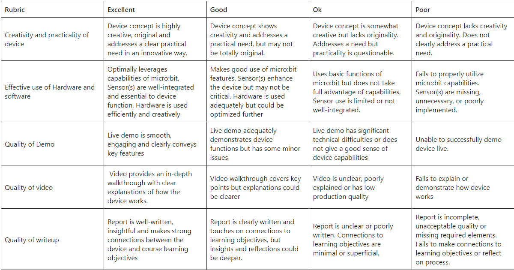

# Mission 1: Design and build a smart home device prototype
This far, you have learnt the following:

- **Compute**: Understand the fundamentals of computation and how microcontrollers process information
- **Storage & Memory:** Learn about different types of storage and memory in computing devices
- **Hardware & Software:** Explore the interplay between physical components and code
- **Inputs & Outputs**: Discover how devices take in data from the environment and produce outputs

For this mission, you are required to:

#### Design and build a device to serve a practical function and improve daily life. 

**Requirements:**

1. Use a Micro:Bit as the main controller.
2. Incorporate at least 1 sensor and one output.
3. Implement basic logic to make the device interactive/automated.
4. You can use any household materials for your project.

**Deliverables:**

1. You should show a one-minute live demo of your working project to your Prof/Instructor in class.
2. Produce a 2-minute video walkthrough with voiceover explaining how your prototype works.
3. Write a short report covering why your device is useful, how your device relates to what you learnt so far in the module and your reflections on building the prototype. (no longer than 3 pages).

**Grading rubrics:**

- Creativity and practicality of device (2) 
- Effective use of Hardware and software (2) 
- Quality of Demo (2) 
- Quality of video (2) 
- Quality of writeup (2)

